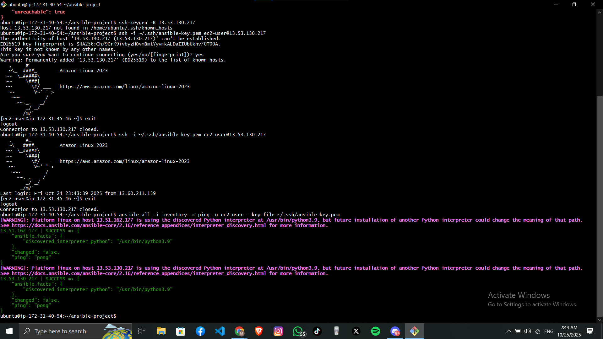

# 🚀 Ansible Web Deployment

A professional Ansible project for deploying static websites to AWS EC2 instances using Apache web server.

## 📋 Overview

This project provides a complete automation solution for deploying static websites to remote servers using Ansible. It's designed to be flexible, reusable, and production-ready.

### **Key Features**
✅ Automated Apache installation and configuration  
✅ Zero-downtime deployment with handlers  
✅ Tag-based execution for selective operations  
✅ Built-in verification and health checks  
✅ Clean separation of concerns (install vs deploy)  
✅ Production-ready security practices  

---

## 📸 Project in Action

### **Website Successfully Deployed**


### **Connectivity Test Passed**


---

## 🏗️ Project Structure

```
ansible-web-deployment/
├── screenshots/               # Project screenshots
├── your-website-files/        # Your static website files (HTML, CSS, JS, images)
├── inventory                  # Server definitions
├── ansible.cfg                # Ansible configuration
├── install-apache.yml         # Apache installation playbook
├── deploy-website.yml         # Website deployment playbook
├── .gitignore                 # Git ignore rules
└── README.md                  # This file
```

---

## 🖥️ Infrastructure Setup

This project is designed for the following infrastructure:

### **Ansible Controller**
- Manages all deployments via SSH
- Requires Ansible 2.9+

### **Web Servers**
- **OS**: Amazon Linux 2 / RHEL-based
- **Web Server**: Apache (httpd)
- **Default Path**: `/var/www/html/`
- **Port**: 80 (HTTP)

### **Database Servers** *(Optional)*
- Reserved for future backend integration

---

## 📦 Prerequisites

Before using this project, ensure you have:

- ✅ **Ansible installed** on the controller machine
  ```bash
  ansible --version
  ```

- ✅ **SSH access** to target servers with key-based authentication

- ✅ **AWS Security Groups** configured to allow:
  - Port 22 (SSH) from controller
  - Port 80 (HTTP) from desired sources

- ✅ **Your website files** ready in a directory

---

## ⚙️ Configuration

### **1. Update Inventory File**

Edit the `inventory` file with your server details:

```ini
[web]
web01 ansible_host=YOUR_WEB_SERVER_IP ansible_user=ec2-user

[db]
db01 ansible_host=YOUR_DB_SERVER_IP ansible_user=ec2-user

[all:vars]
ansible_ssh_private_key_file=~/.ssh/YOUR_KEY.pem
```

### **2. Configure Website Source**

In `deploy-website.yml`, update the `website_source` variable:

```yaml
vars:
  website_source: your-website-files  # Name of your website directory
```

### **3. Customize Variables** *(Optional)*

You can modify these variables in the playbooks:

```yaml
web_root: /var/www/html              # Apache document root
apache_service: httpd                 # Service name
web_owner: ec2-user                  # File ownership
web_group: ec2-user                  # Group ownership
```

---

## 🚀 Deployment Guide

### **Step 1: Install Apache** (First Time Only)

This step installs and configures Apache on your web servers:

```bash
ansible-playbook install-apache.yml
```

**What it does:**
- Updates system packages
- Installs Apache web server
- Creates web root directory
- Starts and enables Apache service
- Configures firewall (if applicable)

---

### **Step 2: Deploy Your Website**

Deploy your static website files:

```bash
ansible-playbook deploy-website.yml
```

**What it does:**
- Ensures Apache is installed
- Cleans old website files
- Copies new website files
- Sets correct permissions
- Restarts Apache (if needed)
- Verifies deployment

---

### **Step 3: Verify Deployment**

Check if your website is accessible:

```bash
# Replace with your server IP
curl -I http://YOUR_SERVER_IP

# Or open in browser
http://YOUR_SERVER_IP
```

**Expected Result:**


---

## 🏷️ Advanced Usage with Tags

Execute specific parts of the deployment:

### **Installation Tags**
```bash
# Install Apache only
ansible-playbook deploy-website.yml --tags install

# Setup and configuration
ansible-playbook install-apache.yml --tags setup
```

### **Deployment Tags**
```bash
# Clean old files
ansible-playbook deploy-website.yml --tags cleanup

# Deploy files only
ansible-playbook deploy-website.yml --tags deploy

# Restart service
ansible-playbook deploy-website.yml --tags service
```

### **Verification Tags**
```bash
# Verify deployment only
ansible-playbook deploy-website.yml --tags verify
```

### **Combined Operations**
```bash
# Clean and deploy
ansible-playbook deploy-website.yml --tags cleanup,deploy

# Full deployment with verification
ansible-playbook deploy-website.yml --tags deploy,verify
```

---

## 🎯 Target Specific Hosts

Deploy to specific servers:

```bash
# Deploy to web01 only
ansible-playbook deploy-website.yml --limit web01

# Deploy to specific IP
ansible-playbook deploy-website.yml --limit 13.51.162.177

# Deploy to web group only
ansible-playbook deploy-website.yml --limit web
```

---

## 🧪 Testing and Validation

### **Dry Run** (Check Mode)
Test without making changes:
```bash
ansible-playbook deploy-website.yml --check
```

### **Diff Mode**
See what will change:
```bash
ansible-playbook deploy-website.yml --check --diff
```

### **Verbose Output**
Debug issues with detailed output:
```bash
ansible-playbook deploy-website.yml -vvv
```

---

## ✅ Verification Commands

### **Check Apache Status**
```bash
ansible web -m shell -a "systemctl status httpd"
```

### **Verify Deployed Files**
```bash
ansible web -m shell -a "ls -lah /var/www/html/"
```

### **Test Connectivity**
```bash
ansible all -m ping
```

**Expected Output:**


### **Check Apache is Listening**
```bash
ansible web -m shell -a "ss -tuln | grep :80"
```

### **View Apache Process**
```bash
ansible web -m shell -a "ps aux | grep httpd"
```

---

## 🔧 Troubleshooting

### **Common Issues and Solutions**

| Issue | Diagnosis | Solution |
|-------|-----------|----------|
| **Apache not running** | Service stopped | `ansible web -m service -a "name=httpd state=restarted"` |
| **Permission denied (SSH)** | Key permissions wrong | `chmod 400 ~/.ssh/your-key.pem` |
| **Port 80 blocked** | Firewall/Security Group | Check AWS Security Group or firewalld |
| **Files not found** | Wrong source path | Verify `website_source` variable |
| **Connection timeout** | Network/SSH issue | Check Security Group allows SSH from controller |
| **Wrong website content** | Old files cached | Use `--tags cleanup,deploy` |

### **Debug Commands**

```bash
# Check Apache error logs
ansible web -m shell -a "tail -50 /var/log/httpd/error_log"

# Check Apache access logs
ansible web -m shell -a "tail -50 /var/log/httpd/access_log"

# Check Apache configuration
ansible web -m shell -a "httpd -t"

# View systemd journal
ansible web -m shell -a "journalctl -u httpd -n 50"
```

---

## 📊 Useful Ansible Commands

### **Ad-hoc Commands**

```bash
# Restart Apache
ansible web -m service -a "name=httpd state=restarted"

# Check disk space
ansible web -m shell -a "df -h"

# Check memory usage
ansible web -m shell -a "free -h"

# Update packages
ansible web -m yum -a "name=* state=latest" --become

# Remove website files
ansible web -m shell -a "rm -rf /var/www/html/*" --become
```

### **Gather Facts**

```bash
# Collect system information
ansible web -m setup

# Get specific facts
ansible web -m setup -a "filter=ansible_distribution*"
```

---

## 🔐 Security Best Practices

### **1. SSH Key Security**
```bash
# Set correct permissions
chmod 400 ~/.ssh/your-key.pem

# Never commit keys to version control
# (already in .gitignore)
```

### **2. AWS Security Groups**
- **Port 22 (SSH)**: Restrict to controller IP only
- **Port 80 (HTTP)**: Configure based on requirements
- **Port 443 (HTTPS)**: Add when implementing SSL

### **3. Use Ansible Vault for Secrets**
```bash
# Create encrypted file
ansible-vault create secrets.yml

# Edit encrypted file
ansible-vault edit secrets.yml

# Use in playbook
ansible-playbook deploy-website.yml --ask-vault-pass
```

### **4. Implement Principle of Least Privilege**
- Use `become` only when necessary
- Create dedicated deployment user
- Limit sudo permissions

---

## 📝 Customization Guide

### **Adding New Servers**

1. Add to `inventory`:
   ```ini
   [web]
   web01 ansible_host=IP_ADDRESS_1 ansible_user=ec2-user
   web02 ansible_host=IP_ADDRESS_2 ansible_user=ec2-user
   ```

2. Run playbooks:
   ```bash
   ansible-playbook install-apache.yml --limit web02
   ansible-playbook deploy-website.yml --limit web02
   ```

### **Deploying Different Websites**

1. Change `website_source` variable:
   ```yaml
   vars:
     website_source: my-new-website
   ```

2. Run deployment:
   ```bash
   ansible-playbook deploy-website.yml
   ```

### **Adding SSL/HTTPS**

Create a new playbook `setup-ssl.yml`:
```yaml
---
- name: Install SSL certificate
  hosts: web
  become: true
  tasks:
    - name: Install certbot
      yum:
        name: certbot
        state: present
    
    # Add SSL configuration tasks
```

---

## 🎯 Future Enhancements

Potential improvements for this project:

- [ ] **SSL/TLS Support**: Implement HTTPS with Let's Encrypt
- [ ] **Load Balancer**: Add HAProxy or AWS ELB integration
- [ ] **Monitoring**: Integrate Prometheus/Grafana
- [ ] **Backup Solution**: Automated backup and restore
- [ ] **CI/CD Integration**: GitHub Actions pipeline
- [ ] **Multi-Environment**: Dev/Staging/Production configs
- [ ] **Database Integration**: Connect backend databases
- [ ] **Health Checks**: Advanced monitoring and alerting
- [ ] **Rollback Mechanism**: Version control and rollback
- [ ] **Performance Tuning**: Apache optimization configs

---

## 📚 Project Variables Reference

### **Global Variables** (can be overridden)

| Variable | Default | Description |
|----------|---------|-------------|
| `web_root` | `/var/www/html` | Apache document root |
| `website_source` | `your-website-files` | Source directory name |
| `apache_service` | `httpd` | Service name |
| `web_owner` | `ec2-user` | File owner |
| `web_group` | `ec2-user` | File group |

### **Inventory Variables**

| Variable | Example | Description |
|----------|---------|-------------|
| `ansible_host` | `13.51.162.177` | Server IP address |
| `ansible_user` | `ec2-user` | SSH username |
| `ansible_ssh_private_key_file` | `~/.ssh/key.pem` | SSH key path |

---

## 📖 Learning Resources

- [Ansible Documentation](https://docs.ansible.com/)
- [Ansible Best Practices](https://docs.ansible.com/ansible/latest/user_guide/playbooks_best_practices.html)
- [Apache HTTP Server Docs](https://httpd.apache.org/docs/)
- [AWS EC2 User Guide](https://docs.aws.amazon.com/ec2/)

---

## 🤝 Contributing

Contributions are welcome! Feel free to:
- Report bugs
- Suggest new features
- Submit pull requests
- Improve documentation

---

## 📄 License

This project is licensed under the MIT License - free to use and modify.

---

## 👤 Author

**shi7a505**  
GitHub: [@shi7a505](https://github.com/shi7a505)

---

## 📞 Support

If you encounter issues:

1. **Check logs**: `ansible-playbook deploy-website.yml -vvv`
2. **Review troubleshooting section** above
3. **Open an issue** on GitHub

---

## 🌟 Quick Reference

| Task | Command |
|------|---------|
| **First-time setup** | `ansible-playbook install-apache.yml` |
| **Deploy website** | `ansible-playbook deploy-website.yml` |
| **Test connection** | `ansible all -m ping` |
| **Restart Apache** | `ansible web -m service -a "name=httpd state=restarted"` |
| **Check deployment** | `curl -I http://YOUR_SERVER_IP` |
| **Dry run** | `ansible-playbook deploy-website.yml --check` |
| **Verbose mode** | `ansible-playbook deploy-website.yml -vvv` |

---

**Version**: 1.0  
**Last Updated**: 2025-01-25  
**Tested with**: Ansible 2.9+, Amazon Linux 2, Apache 2.4

---

### 📌 Example Use Case

This project was originally used to deploy the **Kool Form Pack** template, but it's designed to work with any static website. Simply replace the website files and update the configuration.
